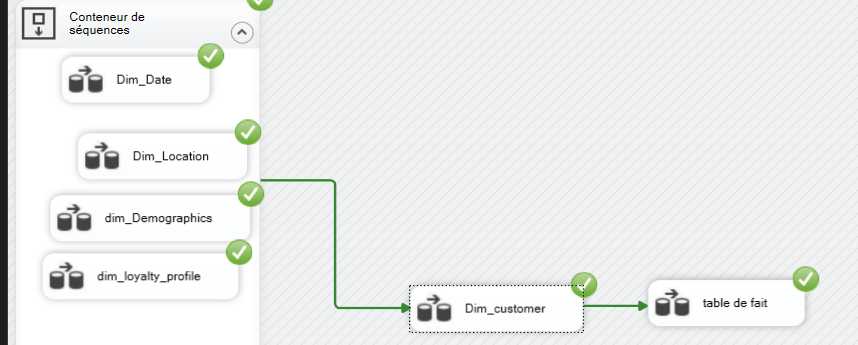

# Airline Loyalty Program - Data Warehouse & ETL ✈️

## 📌 Project Overview
This project demonstrates the end-to-end creation of an enterprise Data Warehouse for analyzing airline customer loyalty. The goal is to consolidate scattered data into a robust structure to identify high-value customer segments and optimize retention strategies.

## 🛠 Tech Stack
- **Database:** SQL Server 
- **ETL:** SQL Server Integration Services (SSIS)
- **Modeling:** Snowflake Schema (Normalized dimensions)
- **Analysis:** Python (Pandas) 
- **Visualization:** PowerBI 

## 🏗 Data Architecture & Modeling
The Data Warehouse is designed using a **Snowflake Schema**. This ensures reduced data redundancy and improved data integrity by normalizing dimension tables (e.g., separating Cities and Countries into distinct linked tables).

## 🔄 ETL Process (SSIS)
Data is extracted, transformed, and loaded (ETL) using **SSIS packages**. The process manages data cleansing, handling Slowly Changing Dimensions (SCD), and orchestrating the load order between dimensions and fact tables.

### ETL Control Flow Overview:
*Visual representation of the orchestration pipeline.*

### Example Data Flow Task:
*Detail of a transformation pipeline populating a normalized customer dimension .*

## 📊 Key Insights
* **Customer Segmentation:** Identified that the top tier (Platinum) constitutes only 5% of members but generates 40% of revenue.
* **Predictive Potential:** The structured data is prepared for future Machine Learning implementation (e.g., Churn Prediction).

## 📁 Files in this Repo
* `schema_dwh.png`: Visual of the Snowflake architecture.
* `etl_control_flow.png` & `etl_data_flow.png`: SSIS package visuals.
* `queries_loyalty.sql`: T-SQL scripts used for specific transformations or analysis.
* `Airline_Loyalty_Analysis.pptx`: Full business presentation.
## 🤖 AI Readiness & Machine Learning Roadmap
This Data Warehouse is not just for reporting; it is built to be the "Single Source of Truth" for predictive modeling. The clean, normalized data in the Snowflake schema provides a high-quality feature set for:

* **Predictive Churn Modeling:** Using historical flight frequency and loyalty point redemption patterns to identify customers at risk of leaving the program (Random Forest / XGBoost).
* **Customer Lifetime Value (CLV) Prediction:** Estimating the future revenue a customer will generate based on their tier and historical booking behavior.
* **Personalized Recommendation Engine:** Leveraging the `Dim_Flight` and `Dim_Customer` relationship to suggest preferred destinations or loyalty upgrades via collaborative filtering.
* **Anomaly Detection:** Identifying fraudulent point accumulation or unusual booking patterns through the `Fact_Loyalty_Activity` table.
